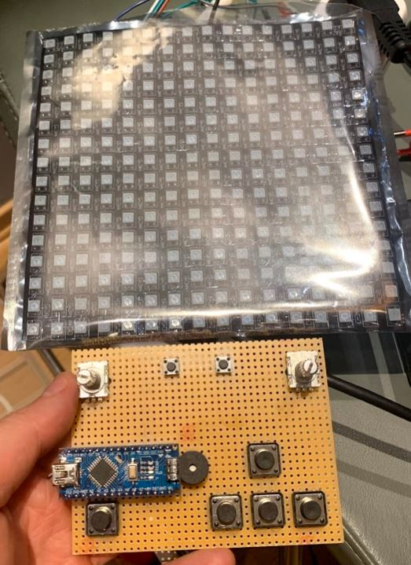
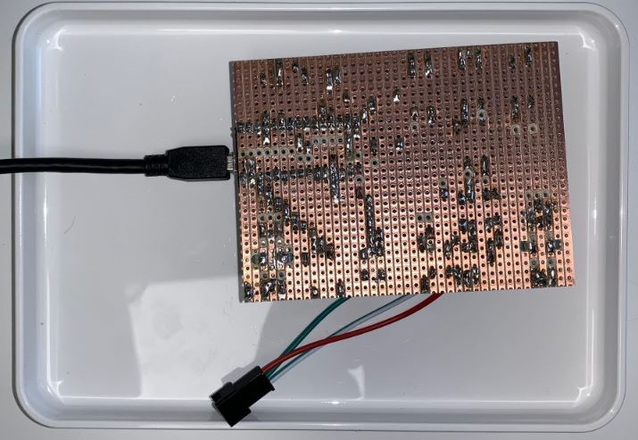
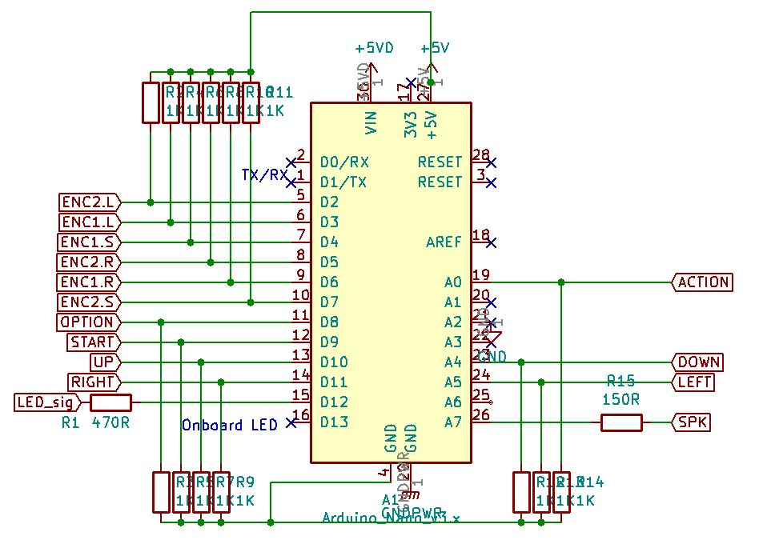

# LED_games
 16x16 LED matrix games and arduino controller with encoders and buttons
## Summary

## Files
* [Schematic PDF](schematic_card.pdf)
* [Schematic KiCAD](Led_game_nano/)
* [Arduino source code](Code/)

## Pictures

*16x16

## BOM 

### Controller board

Made with [https://donatstudios.com/CsvToMarkdownTable](https://donatstudios.com/CsvToMarkdownTable) and an included KiCAD default BOM to CSV plugin that collated the components

| Item | Qty | Reference(s)                                            | Value             | LibPart                                | Footprint           | Datasheet                                                      | Note | 
|--------|-------|-----------------------------------------------------------|---------------------|------------------------------------------|-----------------------|------------------------------------------------------------------|--------| 
| 1    | 1   | A1                                                      | Arduino_Nano_v3.x | MCU_Module:Arduino_Nano_v3.x           | Module:Arduino_Nano | http://www.mouser.com/pdfdocs/Gravitech_Arduino_Nano3_0.pdf, |        | 
| 2    | 4   | C1, C2, C3, C4                                          | 470uF             | Device:CP,,~,                    |                       |                                                                  |        | 
| 3    | 2   | C5, C6                                                  | 100nF             | Device:C,,~,                     |                       |                                                                  |        | 
| 4    | 1   | D1                                                      | DIODE             | pspice:DIODE,,,                  |                       |                                                                  |        | 
| 5    | 2   | J1, J3                                                  | Conn_01x02_Male   | Connector:Conn_01x02_Male,,~,    |                       |                                                                  |        | 
| 6    | 1   | J2                                                      | Conn_01x03_Female | Connector:Conn_01x03_Female,,~     | 16x16 led disp      |                                                                  |        | 
| 7    | 1   | LS1                                                     | Active_Speaker    | Device:Speaker,,~,               |                       |                                                                  |        | 
| 8    | 1   | R1                                                      | 470R              | Device:R,,~,                     |                       |                                                                  |        | 
| 9    | 13  | R2, R3, R4, R5, R6, R7, R8, R9, R10, R11, R12, R13, R14 | 1K                | Device:R,,~,                     |                       |                                                                  |        | 
| 10   | 1   | R15                                                     | 150R              | Device:R,,~,                     |                       |                                                                  |        | 
| 11   | 7   | SW1, SW3, SW4, SW5, SW6, SW7, SW8                       | SW_Push           | Switch:SW_Push,,,                |                       |                                                                  |        | 
| 12   | 1   | SW2                                                     | ENC1              | Device:Rotary_Encoder_Switch,,~, |                       |                                                                  |        | 
| 13   | 1   | SW9                                                     | ENC2              | Device:Rotary_Encoder_Switch,,~, |                       |                                                                  |        | 

### LED matrix

*LED Matrix 16x16 DIY GyverLamp WS2812B RGB Bendable Digital Flexible Individually addressable strip Pixel light wifi lamp DC5V*
$14.99
[Aliexpress link](https://www.aliexpress.com/item/4000384823406.html?spm=a2g0s.9042311.0.0.11c24c4dD5sZfY)

#### Power consmption

Runs on 5V, 50mA per LED

16*16 = 256 leds => 12.8A maximum potiential power draw! USB power supplies tend to max out at 2A so I either need to software limit the power consumtion or use mulitple supplies.

I'll use the [Fastled library](https://github.com/FastLED/FastLED) to control the panel. It can be installed directly through the Arduino library manager.

I use the [Adafruit Neopixel best practices](https://learn.adafruit.com/adafruit-neopixel-uberguide/best-practices) for connecting to and powering the LEDs

### Power supplies

I have access to:

* 0.9A from my laptop USB 
* 2.4A USB power supply (from a RaspberryPi kit)
* 2 A barrel jack power supply (fits Arduino UNO)

I'll software limit the power draw. I'm using a laptop to test the card and USB 3.0 can give [0.9A](https://en.wikipedia.org/wiki/USB_3.0)
I can increase as needed later.

I'll try to buy a barrel jack adapter so that I don't have to cut the cables on the second power supply.

### Microcontroller

I'm using an Arduino Nano with the CH40 USB to transistor logic chip. [Drivers for the chip](https://github.com/Jaknil/Arduino_material/blob/master/CH341SER.EXE)

$2.46 with USB cable
* [Aliexpress link](https://www.aliexpress.com/item/32341832857.html?spm=a2g0s.9042311.0.0.27424c4dasmxDQ)

## In work
* ~~Get the buttons working~~
* Get this to work automagically [KiCAD BOM to Markdown](https://analogoutputblog.wordpress.com/2020/07/03/mark-down-your-bom/)
* Get the encoders working
* [ ] Add checkboxes 

