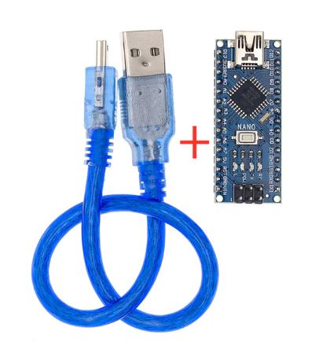
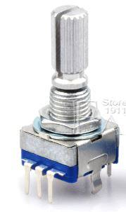

# LED_games
 16x16 LED matrix games and arduino controller with encoders and buttons
## Summary

## Files
* [Schematic PDF](schematic_card.pdf) (Found an error, LED_sig = DATA_PIN)
* [Schematic KiCAD](Led_game_nano/)
* [Arduino source code](Code/)
  * [Etch-A-Sketch](Code/led_game_show_encoder/)
  * [PONG! Two player, with scorekeeping](Code/led_game_show_encoder/)

## Pictures

*16x16

*Not latest version, se PDF for complete schematic*

## BOM 

### Controller board

Made with [https://donatstudios.com/CsvToMarkdownTable](https://donatstudios.com/CsvToMarkdownTable) and an included KiCAD default BOM to CSV plugin that collated the components

| Item | Qty | Reference(s)                                            | Value             | LibPart                                | Footprint           | Datasheet                                                      | Note | 
|--------|-------|-----------------------------------------------------------|---------------------|------------------------------------------|-----------------------|------------------------------------------------------------------|--------| 
| 1    | 1   | A1                                                      | Arduino_Nano_v3.x | MCU_Module:Arduino_Nano_v3.x           | Module:Arduino_Nano | http://www.mouser.com/pdfdocs/Gravitech_Arduino_Nano3_0.pdf, |        | 
| 2    | 4   | C1, C2, C3, C4                                          | 470uF             | Device:CP,,~,                    |                       |                                                                  |        | 
| 3    | 2   | C5, C6                                                  | 100nF             | Device:C,,~,                     |                       |                                                                  |        | 
| 4    | 1   | D1                                                      | DIODE             | pspice:DIODE,,,                  |                       |                                                                  |        | 
| 5    | 2   | J1, J3                                                  | Conn_01x02_Male   | Connector:Conn_01x02_Male,,~,    |                       |                                                                  |        | 
| 6    | 1   | J2                                                      | Conn_01x03_Female | Connector:Conn_01x03_Female,,~     | 16x16 led disp      |                                                                  |        | 
| 7    | 1   | LS1                                                     | Active_Speaker    | Device:Speaker,,~,               |                       |                                                                  |        | 
| 8    | 1   | R1                                                      | 470R              | Device:R,,~,                     |                       |                                                                  |        | 
| 9    | 13  | R2, R3, R4, R5, R6, R7, R8, R9, R10, R11, R12, R13, R14 | 1K                | Device:R,,~,                     |                       |                                                                  |        | 
| 10   | 1   | R15                                                     | 150R              | Device:R,,~,                     |                       |                                                                  |        | 
| 11   | 7   | SW1, SW3, SW4, SW5, SW6, SW7, SW8                       | SW_Push           | Switch:SW_Push,,,                |                       |                                                                  |        | 
| 12   | 1   | SW2                                                     | ENC1              | Device:Rotary_Encoder_Switch,,~, |                       |                                                                  |        | 
| 13   | 1   | SW9                                                     | ENC2              | Device:Rotary_Encoder_Switch,,~, |                       |                                                                  |        | 

### LED matrix

*LED Matrix 16x16 DIY GyverLamp WS2812B RGB Bendable Digital Flexible Individually addressable strip Pixel light wifi lamp DC5V*
$14.99
[Aliexpress link](https://www.aliexpress.com/item/4000384823406.html?spm=a2g0s.9042311.0.0.11c24c4dD5sZfY)

#### Power consumption

Runs on 5V, 50mA per LED

16*16 = 256 leds => 12.8A maximum potiential power draw! USB power supplies tend to max out at 2A so I either need to software limit the power consumtion or use mulitple supplies.

I'll use the [Fastled library](https://github.com/FastLED/FastLED) to control the panel. It can be installed directly through the Arduino library manager.

I use the [Adafruit Neopixel best practices](https://learn.adafruit.com/adafruit-neopixel-uberguide/best-practices) for connecting to and powering the LEDs

### Power supplies

I have access to:

* 0.5A from my laptop USB 
* 2.5A 5V power supply 
 
It is wired to run on either USB or external power, the power sources are connected in paralell. To avoid problems with them feeding each other when both are connected a reverse polarity protection diode is connected on the external power positive lead, this makes it supply a slightly lover voltage to the circuit. That should keep it from going higher voltage that the USB and limit the risk of it feeding current into the USB. The USB is prevented by doing the opposite by the same diode.

In retrospect I could have put such a diode on both supply leads.

The code should software limit to under 2.5A to avoid "brown outs" resetting the arduino

### Microcontroller

I'm using an imported Chinese Arduino Nano with the CH40 USB to transistor logic chip. Remember to select "Old Bootloader" under processor. Herre you can download [drivers for the chip](https://github.com/KubenKoder/Arduino/blob/master/USB%20driver/README.md#usb-drivers)

$2.46 with USB cable
* [Aliexpress link](https://www.aliexpress.com/item/32341832857.html?spm=a2g0s.9042311.0.0.27424c4dasmxDQ)

### Encoders

20 steps per rotation

$1.89 for 5 
[Aliexpress link](https://www.aliexpress.com/item/32872023811.html?spm=a2g0s.9042311.0.0.27424c4dcrN317)

I used this guide for the encoders [buxtronix](http://www.buxtronix.net/2011/10/rotary-encoders-done-properly.html)

## Tasks for later
* Get the BOM to work automagically [KiCAD BOM to Markdown](https://analogoutputblog.wordpress.com/2020/07/03/mark-down-your-bom/)
* Fix the error in schematic
* Upload video of it working
* Make more games using the buttons.
* Add sound to the Pong game
* Add pause/unpause function

## Lessons learned
* No need for external pull up resistors, just activate the internal ones in the arduino

