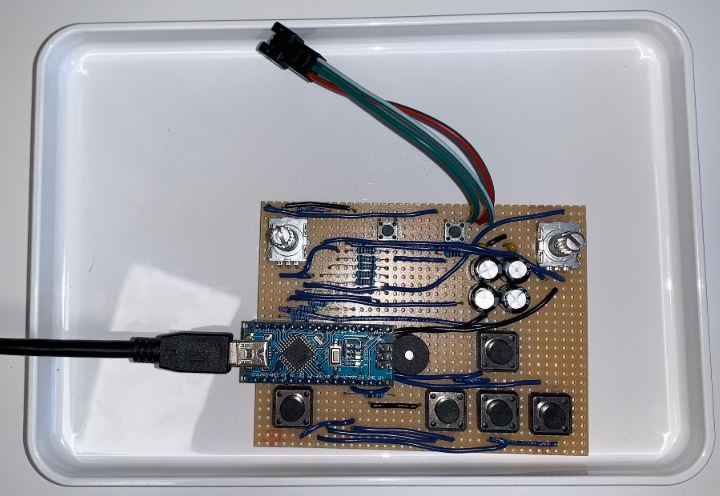

# LED_games
 16x16 LED matrix games and arduino controller with encoders and buttons
## Summary

## Files
* [Schematic PDF](schematic_card.pdf)
* [Schematic KiCAD](Led_game_nano/)
* [Arduino source code](Code/)

## Pictures

## BOM

Made with [https://donatstudios.com/CsvToMarkdownTable](https://donatstudios.com/CsvToMarkdownTable) and an included KiCAD default BOM to CSV plugin that collated the components

| Item | Qty | Reference(s)                                            | Value             | LibPart                                | Footprint           | Datasheet                                                      | Note | 
|--------|-------|-----------------------------------------------------------|---------------------|------------------------------------------|-----------------------|------------------------------------------------------------------|--------| 
| 1    | 1   | A1                                                      | Arduino_Nano_v3.x | MCU_Module:Arduino_Nano_v3.x           | Module:Arduino_Nano | http://www.mouser.com/pdfdocs/Gravitech_Arduino_Nano3_0.pdf, |        | 
| 2    | 4   | C1, C2, C3, C4                                          | 470uF             | Device:CP,,~,                    |                       |                                                                  |        | 
| 3    | 2   | C5, C6                                                  | 100nF             | Device:C,,~,                     |                       |                                                                  |        | 
| 4    | 1   | D1                                                      | DIODE             | pspice:DIODE,,,                  |                       |                                                                  |        | 
| 5    | 2   | J1, J3                                                  | Conn_01x02_Male   | Connector:Conn_01x02_Male,,~,    |                       |                                                                  |        | 
| 6    | 1   | J2                                                      | Conn_01x03_Female | Connector:Conn_01x03_Female,,~     | 16x16 led disp      |                                                                  |        | 
| 7    | 1   | LS1                                                     | Active_Speaker    | Device:Speaker,,~,               |                       |                                                                  |        | 
| 8    | 1   | R1                                                      | 470R              | Device:R,,~,                     |                       |                                                                  |        | 
| 9    | 13  | R2, R3, R4, R5, R6, R7, R8, R9, R10, R11, R12, R13, R14 | 1K                | Device:R,,~,                     |                       |                                                                  |        | 
| 10   | 1   | R15                                                     | 150R              | Device:R,,~,                     |                       |                                                                  |        | 
| 11   | 7   | SW1, SW3, SW4, SW5, SW6, SW7, SW8                       | SW_Push           | Switch:SW_Push,,,                |                       |                                                                  |        | 
| 12   | 1   | SW2                                                     | ENC1              | Device:Rotary_Encoder_Switch,,~, |                       |                                                                  |        | 
| 13   | 1   | SW9                                                     | ENC2              | Device:Rotary_Encoder_Switch,,~, |                       |                                                                  |        | 

## In work
* ~~Get the buttons working~~
* Get this to work automagically [KiCAD BOM to Markdown](https://analogoutputblog.wordpress.com/2020/07/03/mark-down-your-bom/)
* Get the encoders working
* [ ] Add checkboxes 
